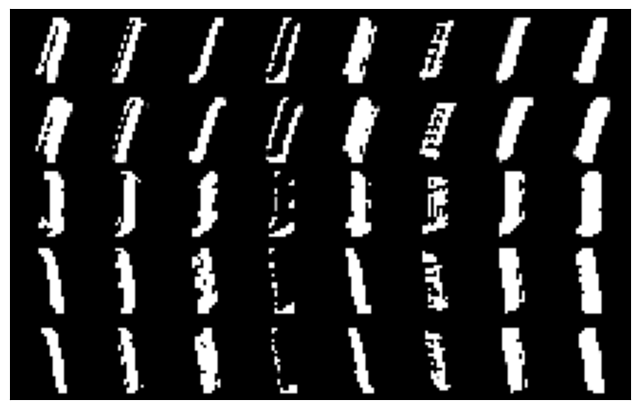

# Training-Artificial-Neural-Network
In this project, I performed experiments on artificial neural network (ANN) training and drew conclusions from the experimental results. I implemented and trained multi layer perceptron (MLP) and convolutional neural network (CNN) classifiers on CIFAR-10 dataset.

## Part2. Implementing a Convolutional Layer with NumPy

2.1. Convolutional Neural Networks (CNNs) are widely used at the center of deep learning algorithms. 
The previous networks, called traditional neural networks, are less effective than CNNs because of their 
input shape restrictions. In order to use these traditional neural networks, the input size should be a 
constant number. In addition, traditional neural networks have many parameters to be trained. As the 
number of parameters increases, the effectiveness of the network decreases. So, it is hard to train a 
traditional neural network.

On the other hand, CNNs have a better approach to these problems. It is not restricted to using
a fixed input shape while using CNNs. In other words, the shape of the input can be arbitrary. 
Furthermore, the number of parameters in the CNNs is decreased. That’s why it is easier to train a CNN 
when compared to a traditional neural network. 

Especially for computer vision and image processing tasks, CNNs are used a lot. The main 
reason is that CNNs can extract features from the input. These features are edges, corners, patterns, 
and textures. Object detection, segmentation, and image classification operations can be done 
effectively using these feature extraction abilities. To conclude, using CNNs in image processing tasks is
important since CNNs can extract features from inputs efficiently.

2.2. Kernels are filters that can extract features from the input image. A kernel is a matrix in which the 
weights are involved. Generally, the kernel size is chosen to be smaller than the input size in order to 
extract local features from the input. The kernel is convolved with the input image and gives an output 
smaller than the input image. The stride value specifies the movement of the kernel. For example, ifthe stride is selected as 1, then the kernel, or filter, moves one by one through the input matrix, and 
each movement kernel is performed a dot product operation with the input matrix. By doing so, highlevel features such as patterns, edges, and corners can be extracted from the input. 

The sizes of a kernel depend on the application. For example, a smaller kernel should be used 
to extract local features from the input. On the other hand, to extract larger features, a larger kernel 
can be used. The size of the kernel consists of two parameters, namely kernel height and kernel width. 
Kernel height is the number of rows in the kernel, and the kernel width is the number of columns in 
the kernel. Generally, kernels are chosen as a square matrix, but it is not mandatory. Rectangular 
kernels can be used as well.

2.3. After the convolutional layer, an output image is generated. This image has 5 rows and 8 columns. 
Each row corresponds to the same number class, and each column corresponds to a different kernel. 
The convolutional layer tried to extract features from the given input, and this resulted in 8 different 
channels for each number. But as it can be seen from the image, the pattern of the number is not 
understood yet to decide which number class is detected. That’s why the convolutional layer itself is 
not sufficient. According to different kernels, different outputs are obtained. It can be concluded that 
outputs of the same kernel looks like each other, and outputs of different kernels are different from 
each other.

2.4. The convolutional layer consists of eight 4x4 kernels. Each kernel has its own weights. So, after the 
convolution operation, output of the convolutional layer will give us 8 different images or matrices 
which are called channels. In the output image, rows correspond to different batches and columns 
corresponds to different kernels. When we examine the same column, almost all of the number in a 
column are similar to each other. The main reason of this similarity comes from the same kernel is 
applied to all of these numbers. Even though they are different numbers, the output channel looks likesimilar. In other words, kernel weights are important fact that affect the output of the convolutional layer. Output channels of the same kernel can look like to each other.

2.5. As it was stated in the previous question, the convolutional layer consists of eight 4x4 kernels, and 
each row corresponds to the same number class, but the output channels are not similar. The main 
reason of this issue is that different kernels have different weights, and the input weights are the same 
for the same row. So, for each convolution operation gives different output. For the same number, 
different kernels are applied. Even though the number does not change, the output channel looks 
different than the others. 

2.6. For feature extraction, using convolutional layers are important but using only one type of kernel 
will give us wrong intuitions about the input image. That’s why using more kernels with different weight 
could be better approach to extract patterns from the input images. Also, by using only one 
convolutional layer is not sufficient. Using more than one convolutional layer could give better results. 
Furthermore, after examining the output image, it can be understood that using only one convolutional 
layer cannot extract complex patterns and high-level features. This type of networks can be described 
as shallow networks and to make feature extraction of these networks better, deeper neural networks 
can be used. Deep neural networks can be created by using multiple convolutional layers that are 
stacked top on each other. In this way, more complex features can be extracted.

