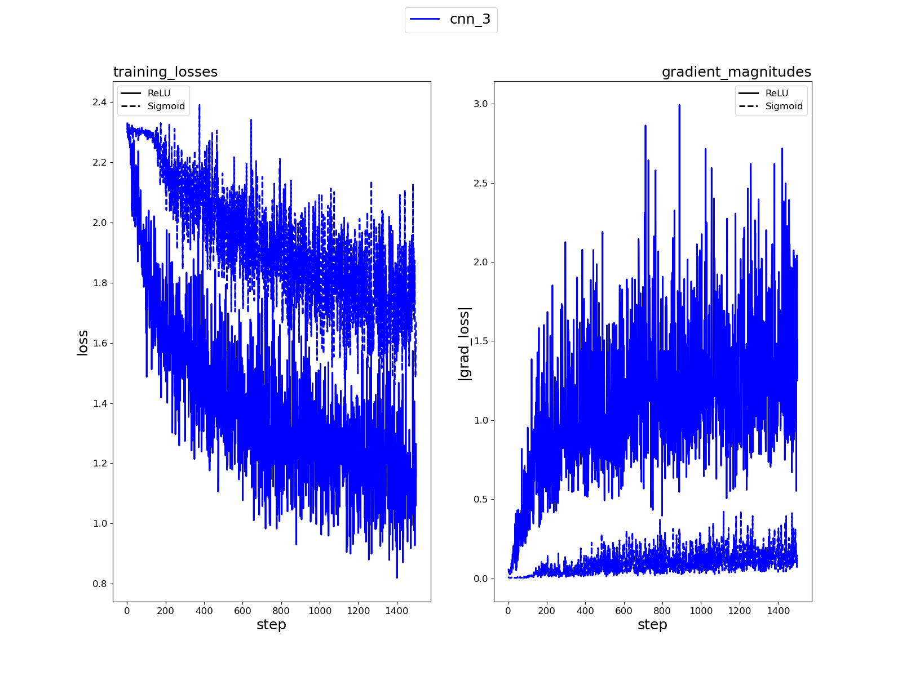
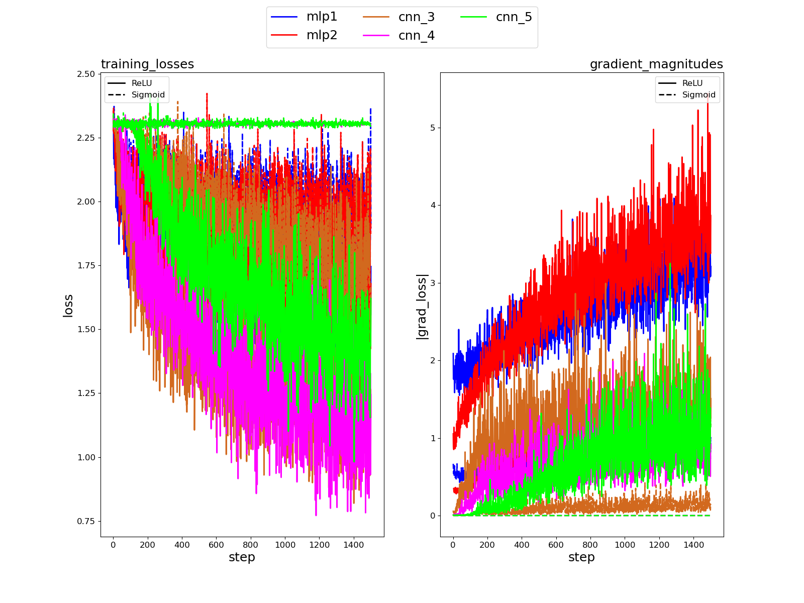

# Training-Artificial-Neural-Network
In this project, I performed experiments on artificial neural network (ANN) training and drew conclusions from the experimental results. I implemented and trained multi layer perceptron (MLP) and convolutional neural network (CNN) classifiers on CIFAR-10 dataset.

## Part2. Implementing a Convolutional Layer with NumPy

2.1. Convolutional Neural Networks (CNNs) are widely used at the center of deep learning algorithms. 
The previous networks, called traditional neural networks, are less effective than CNNs because of their 
input shape restrictions. In order to use these traditional neural networks, the input size should be a 
constant number. In addition, traditional neural networks have many parameters to be trained. As the 
number of parameters increases, the effectiveness of the network decreases. So, it is hard to train a 
traditional neural network.

On the other hand, CNNs have a better approach to these problems. It is not restricted to using
a fixed input shape while using CNNs. In other words, the shape of the input can be arbitrary. 
Furthermore, the number of parameters in the CNNs is decreased. That’s why it is easier to train a CNN 
when compared to a traditional neural network. 

Especially for computer vision and image processing tasks, CNNs are used a lot. The main 
reason is that CNNs can extract features from the input. These features are edges, corners, patterns, 
and textures. Object detection, segmentation, and image classification operations can be done 
effectively using these feature extraction abilities. To conclude, using CNNs in image processing tasks is
important since CNNs can extract features from inputs efficiently.

2.2. Kernels are filters that can extract features from the input image. A kernel is a matrix in which the 
weights are involved. Generally, the kernel size is chosen to be smaller than the input size in order to 
extract local features from the input. The kernel is convolved with the input image and gives an output 
smaller than the input image. The stride value specifies the movement of the kernel. For example, ifthe stride is selected as 1, then the kernel, or filter, moves one by one through the input matrix, and 
each movement kernel is performed a dot product operation with the input matrix. By doing so, highlevel features such as patterns, edges, and corners can be extracted from the input. 

The sizes of a kernel depend on the application. For example, a smaller kernel should be used 
to extract local features from the input. On the other hand, to extract larger features, a larger kernel 
can be used. The size of the kernel consists of two parameters, namely kernel height and kernel width. 
Kernel height is the number of rows in the kernel, and the kernel width is the number of columns in 
the kernel. Generally, kernels are chosen as a square matrix, but it is not mandatory. Rectangular 
kernels can be used as well.

2.3. After the convolutional layer, an output image is generated. This image has 5 rows and 8 columns. 
Each row corresponds to the same number class, and each column corresponds to a different kernel. 
The convolutional layer tried to extract features from the given input, and this resulted in 8 different 
channels for each number. But as it can be seen from the image, the pattern of the number is not 
understood yet to decide which number class is detected. That’s why the convolutional layer itself is 
not sufficient. According to different kernels, different outputs are obtained. It can be concluded that 
outputs of the same kernel looks like each other, and outputs of different kernels are different from 
each other.

2.4. The convolutional layer consists of eight 4x4 kernels. Each kernel has its own weights. So, after the 
convolution operation, output of the convolutional layer will give us 8 different images or matrices 
which are called channels. In the output image, rows correspond to different batches and columns 
corresponds to different kernels. When we examine the same column, almost all of the number in a 
column are similar to each other. The main reason of this similarity comes from the same kernel is 
applied to all of these numbers. Even though they are different numbers, the output channel looks likesimilar. In other words, kernel weights are important fact that affect the output of the convolutional layer. Output channels of the same kernel can look like to each other.

2.5. As it was stated in the previous question, the convolutional layer consists of eight 4x4 kernels, and 
each row corresponds to the same number class, but the output channels are not similar. The main 
reason of this issue is that different kernels have different weights, and the input weights are the same 
for the same row. So, for each convolution operation gives different output. For the same number, 
different kernels are applied. Even though the number does not change, the output channel looks 
different than the others. 

2.6. For feature extraction, using convolutional layers are important but using only one type of kernel 
will give us wrong intuitions about the input image. That’s why using more kernels with different weight 
could be better approach to extract patterns from the input images. Also, by using only one 
convolutional layer is not sufficient. Using more than one convolutional layer could give better results. 
Furthermore, after examining the output image, it can be understood that using only one convolutional 
layer cannot extract complex patterns and high-level features. This type of networks can be described 
as shallow networks and to make feature extraction of these networks better, deeper neural networks 
can be used. Deep neural networks can be created by using multiple convolutional layers that are 
stacked top on each other. In this way, more complex features can be extracted.

## Part3. Experimenting ANN Architectures 

### Case 1: Multi Layer Perceptron 1 (Mlp1)

### Case 2: Multi Layer Perceptron 2 (Mlp2)

### Case 3: Convolutional Neural Network 3 (CNN3)

### Case 4: Convolutional Neural Network 4 (CNN4)

### Case 5: Convolutional Neural Network 5 (CNN5)

**Q1.** A classifier's generalization performance measures how effectively a classifier can correctly 
categorize new data that wasn't used during the training phase. In other words, it evaluates how well 
the classifier can apply the data it discovered from the training set to new, unexplored data.
A classifier with strong generalization performance may correctly categorize new data, even 
when different from the training data. On the other hand, the classifier may overfit the training data 
and perform poorly on new data if it has poor generalization performance.
Several metrics can be used to assess a classifier's generalization ability, including accuracy, 
precision, recall, F1-score, and area under the receiver operating characteristic curve (AUC-ROC). These 
metrics can be used to compare several classifiers' performance and ascertain how well the classifier 
works on new data.

**Q2.** The validation vs. training accuracy plot can give a better approach to inspect the 
generalization performance of the models since the training accuracy of the model most of the time 
increases, but the validation accuracy does not. The main reason for this issue is that the model starts 
to overfit the training data, especially for a high number of epochs and many runs that make the model 
overfit the data. That's why even though the model's training accuracy increases, the model's validation 
accuracy decreases. In addition to the validation accuracy vs. training accuracy plot, other types of plots 
can be used to inspect the model's generalization performance. These methods include Confusion 
Matrix, Prevision-Recall Curve, ROC Curve (Receiver Operating Characteristic), and Learning Curve. Still, 
in our case, we plotted the validation accuracy vs. training accuracy, training loss, and best test 
performance curves.

**Q3.** The generalization performance of the architectures can be compared by inspecting the 
validation accuracy vs. training accuracy plots. As we examine these plots, we can see that the 
multilayer perceptron architectures do not show a good generalization performance. Both mlp1 and 
mlp2 architectures have shown similar validation accuracy vs. training accuracy plots. In both cases, 
the training accuracy of the architectures increases. The training accuracies of the architectures started 
from 42 levels and rose to 52 levels.
On the other hand, the validation accuracies of the architectures remained at almost the same 
level, which is 38. Furthermore, as the training number increases, the validation accuracy of the 
architectures starts to decrease after a certain point which shows that these two architectures, mlp1, 
and mlp2 are not good at generalization. They overfit the data, and even though their training 
accuracies increased and their training losses decreased, the validation accuracies of these 
architectures show that they did not learn the pattern of the data correctly. 

Regarding the CNN architectures, cnn_3, cnn_4, and cnn_5 architectures showed similar 
performances in terms of generalization. When I examine the training losses of these CNN 
architectures, the training loss of these architectures tends to decrease in time. If we increase the 
number of runs, some of the architectures will give a better performance. In addition to the training 
losses, the validation accuracy vs. training accuracy plots shows that all of these CNN architectures are 
good at generalization. The cnn_3 architecture had 58 training accuracy and 54.5 validation accuracy 
at the beginning of the training. Still, after the training finished, the training accuracy of the cnn_3 
architecture was 67, and the validation accuracy of the model was 57, which indicates that the model 
learned the pattern of the data and increased the accuracy of the model.

Moreover, the cnn_4 architecture showed a similar training loss curve and validation accuracy 
vs. training accuracy curve with a slight difference. In this architecture, after step 4, the validation 
accuracy of the model has not improved much, which shows that model started to overfit the data. 
The generalization of the architecture is about to be decreased since the training accuracy of the 
architecture tends to increase in time, but the validation accuracy did not. Lastly, the cnn_5 
architecture showed one of the best generalization performances among the other architectures. The 
main reason for this conclusion is that the validation accuracy vs. training accuracy plot has a similar 
shape. In other words, as the training accuracy increases, the validation accuracy increases too, which 
makes the model prone to different data types since it has a better generalization performance.

**Q4.** The quantity of learnable weights that a machine learning model must modify during training 
is the number of parameters in the model. Generally speaking, a model with more parameters can 
represent more complicated functions, resulting in greater performance on the training set of data. 
This may or may not lead to improved generalization performance on unknown data.

In reality, overfitting, where the model is too closely adapted to the training data and performs 
poorly on new, unforeseen data, can result from having too many parameters. This is due to the 
possibility that the model is catching noise or peculiarities in the training data that do not transfer to 
new data. This is especially problematic when there are many more parameters than training data.
When we examine the architectures, the cnn_5 architecture was one of the best-performing 
models. One of the main reasons for this result is that there are several more parameters in this 
architecture, and in this way, it can learn the pattern better. 

On the other hand, if more than the number of parameters in an architecture is needed, the architecture can show wrong classification and 
generalization performances. So, the optimum number of parameters should be selected to train the 
model with good classification and generalization performances.

**Q5.** The number of layers in a machine learning model architecture is called the model's depth. 
In general, but only sometimes, a deeper architecture can improve performance on both the training 
and test data.

A deeper architecture has the benefit of being able to capture more abstract and complicated 
properties, which can be helpful when learning hierarchical representations of the data. As a result, 
the model can develop its ability to distinguish between classes, resulting in improved performance on 
the training data.

Deeper designs, however, may also be harder to train and may experience disappearing or 
bursting gradients. These problems may make it difficult for the model to pick up helpful information 
and result in subpar performance. Deeper architectures may also be more prone to overfitting, mainly 
if the model is overly complicated compared to the amount of training data.

Techniques like residual or skip connections can be used to reduce vanishing or exploding gradients,
and regularization techniques can be used to avoid overfitting to address these problems.

**Q6.** When I examine the visualizations of the weights, the mlp1 and mlp2 architectures have 
shown a different weight visualization, and the CNN architectures have shown another weight 
visualization. The main difference between these two architecture types is the Max-Pooling layer since 
the size of the matrix decreases because of the Max-Pooling layer, and the output is not interpretable. 
On the other hand, the weight visualizations of the mlp1 and mlp2 architectures have shown patterns.

If I examine these visualizations, the architectures tend to learn the curved figures and some straight 
lines. Especially in the visualizations of the mlp2 architecture, the curves are more precise, and the 
learning of the pattern can be seen easily. Regarding the CNN architectures, it is hard to comment on 
the weight visualizations since the outputs are just 3x3 matrices with white, gray, and black boxes. I 
tried to comment on these visualizations, but the patterns that the CNN architectures learned are not 
easily interpretable.

**Q7.** The mlp1 and mlp2 architectures are specialized to detect the classes that have more curved 
features, namely automobiles, cats, and dogs. It can be concluded from their weight visualizations that 
they have extracted more curved patterns, and the edges of the objects can be seen clearly. When it 
comes to CNN architectures, these models are more generalized architectures, and they are better at 
finding the patterns of the objects in the given input dataset. The hard part is to interpret the weight 
visualizations.

**Q8.** The weights of the mlp1 and mlp2 architectures are more interpretable since their curved 
and straight-line patterns are easily seen from their weight visualizations. On the other hand, CNN 
architectures are hard to comment on.

**Q9.** The multilayer perceptron models, mlp1 and mlp2, have completely connected layers. 
However, mlp2 has a deeper design than mlp1 because it has a second hidden layer. Both models have 
a linear output layer without a bias term and ReLU activation functions between layers.
In terms of completely connected layers and ReLU activation functions, mlp2 is similar to mlp1, 
but it has a more intricate architecture and an additional hidden layer. One hidden layer makes for the 
simpler architecture known as mlp1.

Three convolutional layers are followed by three fully connected layers in the convolutional 
neural network known as the cnn_3. In order to extract features from the input image, each 
convolutional layer applies a set of learnable filters. These features are then passed via non-linear 
activation functions, such as ReLU (Rectified Linear Unit), in order to incorporate non-linearity into the 
model. Following flattening, the output of the last convolutional layer is passed into the fully connected 
layers, which carry out the classification process.

Similar to the cnn_3, the cnn_4 has a fourth convolutional layer, making it a four-layer CNN. 
The additional convolutional layer enables the network to learn more intricate information from the 
input image, potentially enhancing its accuracy in classifying images.

In terms of their structures, cnn3, cnn4, and cnn5 are all similar in that they use convolutional 
layers to extract features from the input image, followed by fully connected layers to perform 
classification. However, cnn4 and cnn5 are more complex than cnn3, with additional convolutional 
layers that allow them to learn more complex features. Additionally, cnn5 has an additional maxpooling layer that helps it to learn translation-invariant features.

Similar to the cnn_4, the cnn_5 is a five-layer CNN, but it adds a convolutional layer before a 
max-pooling layer. The max-pooling layer shrinks the input image's spatial size and aids in the network's 
learning of translation-invariant features, which can increase the network's resistance to changes in 
the input image.

In terms of their structural similarities, CNNs cnn_3, cnn_4, and cnn_5 all use convolutional 
layers to extract features from the input image before performing classification using fully connected 
layers. In contrast, CNNs cnn_4 and cnn_5 are more sophisticated than cnn_3 and can learn more 
intricate characteristics since they have more convolutional layers. A further max-pooling layer on 
cnn_5 aids in the learning of translation-invariant features.

The performance of CNN architectures is superior to MLP architectures. One of the main 
reasons for this is that extracting features and recognizing patterns are more successful than MLP 
architectures thanks to the convolutional layers and max-pool layers in the architecture. In addition to 
these, CNN architectures also have performance differences among themselves. Although the cnn_3architecture is a model with high generalization performance, its training and validation accuracy values are not as high as other CNN architectures. This shows that cnn_3 can have a better training 
score with more training. As for the cnn_4 architecture, although it has higher training accuracy than 
cnn_3, it did not perform well enough in terms of validation accuracy. Apart from these, the cnn_5 
architecture showed a superior result than all other architectures in terms of both training accuracy 
and validation accuracy. This shows that CNN architectures are better at classification than MLP 
architectures. Among the CNN architectures, the most successful model is cnn_5.

**Q10.** I would choose the cnn_5 architecture for the classification task. There are many reasons 
for this, but first of all, I conclude that the cnn_5 architecture, which has a high training accuracy value, 
learns the data well. In addition, seeing that the validation accuracy value does not fall behind the 
training accuracy value shows that the generalization performance of the model is quite good, and it 
will give good results in different data types. In addition to these, the training loss value of the model 
is less than all other models, and thanks to this model, which has a very high test accuracy value, I think 
that I can achieve a good performance even with data that was not included in the training before.

## Part4. Experimenting Activation Functions

**Q1.** The mlp1_sigmoid neural network has a smaller training loss than the mlp1_relu neural 
network, as can be seen by looking at the training losses. This shows that, at least in terms of 
reducing the loss function, the mlp1_sigmoid network is able to learn the training data better than 
the mlp1_relu network.

Next, we can see that the mlp1_relu neural network has greater gradient magnitudes than the 
mlp1_sigmoid network by comparing the gradient amplitudes. This is not unexpected given that, 
especially when the input values are big, the ReLU activation function can generate gradients that are 
more aggressive than those produced by the sigmoid function. The mlp1_sigmoid network, on the 
other hand, seems to have a more consistent gradient behavior, with lower magnitudes that only 
marginally rise over training. This could help prevent problems like gradient explosion or disappearance 
and improve generalization performance on untested data.

In conclusion, the choice of activation function may significantly affect a neural network's 
training loss and gradient behavior. When it comes to lowering the loss and avoiding gradient problems, 
sigmoid may do better than ReLU, which can result in greater gradients and possibly quicker learning.

The mlp2_sigmoid network once more has a lower training loss than the mlp2_relu network, 
as can be seen by looking at the training losses. This shows that, at least in terms of reducing the loss 
function, the mlp2_sigmoid network is able to learn the training data better than the mlp2_relu 
network. As opposed to the previous example, the difference in training losses between the two 
networks is greater here, pointing to a stronger benefit for sigmoid activation.

The mlp2_relu neural network, when compared to the mlp2_sigmoid network, once more has 
bigger gradient magnitudes, as can be seen by looking at the gradient magnitudes. In contrast to the 
prior example, the magnitude difference between the two networks is smaller here, suggesting that 
the ReLU activation function may not be as aggressive in generating gradients. Although the 
magnitudes of the gradients are smaller and only marginally larger throughout training, the 
mlp2_sigmoid network nevertheless displays a more consistent gradient behavior.

To conclude, similar to the previous experiment, the results from this one also reveal that the 
mlp2_sigmoid network performs better in terms of minimizing training loss and displaying a more 
stable gradient behavior.

Next, we can see that the cnn_3_relu neural network has bigger gradient magnitudes than the 
cnn_3_sigmoid network by comparing the gradient amplitudes. Although the gradient magnitudes in 
the cnn_3_sigmoid network are quite tiny, this may indicate that the network is not picking up new 
information as quickly as the cnn_3_relu network. The relatively small gradients in the cnn_3_Sigmoid 
network might be slowing down learning, preventing the network from developing as quickly as it 
could.

In conclusion, this experiment's findings indicate that the cnn_3_sigmoid network performs 
better than the cnn_3_relu network in minimizing training loss. The cnn_3_sigmoid network's 
extremely modest gradient magnitudes, however, would suggest that the network is not learning as 
well as it could.

The cnn_4_relu network has a substantially smaller training loss than the cnn_4_sigmoid 
network, as can be seen by looking at the training losses. In fact, the cnn_4_sigmoid network's training 
loss stayed constant during training, which raises the possibility that the network is not learning at all.

Next, we can see that the cnn_4_relu neural network has greater gradient magnitudes 
compared to the cnn_4_sigmoid network by examining the gradient magnitudes. The cnn_4_sigmoid 
network's gradient magnitudes are 0, which raises the possibility that the network's parameters aren't 
changing at all while being trained.

When we examine the training performance of the cnn_5 architecture, it can be obtained that 
the gradient magnitude of the cnn_5_sigmoid is again zero and the training loss of the cnn_5_sigmoid 
remained unchanged. It means that the cnn_5_sigmoid architecture is not learning the data.

The vanishing gradient problem is a frequent problem in deep neural networks that can happen 
when the gradient is very small (or zero) during backpropagation, which has the effect of giving the 
weights in the network's initial layers very little training data updates. The network's overall 
performance may suffer as a result of these early layers finding it challenging to acquire useful 
representations.

The vanishing gradient problem and neural network depth are closely related concepts. The 
likelihood of running across a vanishing gradient problem rises as a neural network's depth increases. 
This is because each layer might help to reduce the gradient's amplitude since the gradient is often 
back propagated via several layers.

In case of cnn_4_relu and cnn_5_relu architectures may have vanishing gradient problems as a 
result of the rather deep nature of these networks. Although the vanishing gradient issue is generally 
somewhat reduced by the ReLU activation function employed in these networks, it is still possible for 
the gradients to become very small in the deeper layers. The cnn_4_sigmoid and cnn_5_sigmoid 
networks' zero-gradient magnitudes indicate that the sigmoid activation function may be aggravating 
the vanishing gradient issue in these networks.

**Q2.** The activation functions used in the network are one of several potential causes of the 
vanishing gradient problem. The gradients in the backpropagation process can become quite small as 
they are multiplied by the derivatives of activation functions like sigmoid and hyperbolic tangent since 
their derivatives are relatively small (between 0 and 1). As a result, as the gradients are back propagated 
through the layers of the network, they may "vanish" or approach zero, which may make it challenging 
for the earlier layers to acquire useful representations.

The depth of the network is another aspect that may play a role in the vanishing gradient issue. 
The issue of small gradients can be made worse as the network depth increases since more layers must 
be passed through in order to backpropagate the gradients. It's important to remember that deep 
networks can also experience the reverse issue, known as the expanding gradient problem. The 
network can diverge during training when the gradients are very steep, which causes the weights in 
the network to be changed by very large values.

In conclusion, the activation functions' small derivatives and the network's depth together 
might result in very small gradients as they are backpropagated through the layers, leading to the 
vanishing gradient problem.

**Q3.** Gradient scale: Compared to inputs in the [0.0, 1.0] range, inputs in the [0, 255] range can 
cause backpropagation gradients to grow significantly. Due of the relatively huge gradients that can 
result in excessively large weight updates and divergence, there may be problems with numerical 
stability during training.

Initialization of weights: To avoid saturating the activation functions, weights in neural networks 
are often initialized with low values. If the input values are in the [0, 255] range, the initial weights must 
be substantially less to account for the higher input values. If we utilize inputs in the range [0, 255], the 
network may take longer to converge, or it may not converge at all. This is due to the gradients' 
potential for instability, which can cause them to bounce between very large positive and negative 
values and prevent the weights from settling into an ideal arrangement.

Before feeding inputs into the neural network, they must first be normalized to the range [0.0, 
1.0] if they are in the [0, 255] range. This involves an additional stage of preprocessing and may be 
computationally expensive.

## Part5. Experimenting Learning Rate

**Q1.** A hyperparameter called learning rate controls how frequently the model's parameters are 
changed during training. A higher learning rate often results in faster convergence since larger updates 
to the parameters can cover more ground in fewer rounds. However, an excessive learning rate can 
cause the updates to exceed the ideal values, which would eventually create instability and slower 
convergence.

The convergence speed, on the other hand, can be slowed down by a reduced learning rate 
because smaller updates to the parameters require more iterations to reach the optimal values. A 
slower learning rate, meanwhile, can also help the model avoid overshooting and instability.

While using the scheduled learning rate technique, the convergence speed of the model is 
increased up to 5 times because I also trained the same model with another optimizer called Adam and 
I obtained almost the same results as it was in the scheduled learning rate method which shows that 
the learning rate affects the convergence speed of the model. When it is too high, model can easily 
converge since high learning rate results in high convergence speed. 

**Q2.** The deep learning model's ability to converge to a better point can be significantly influenced 
by the learning rate. A faster convergence to a better solution is facilitated by a higher learning rate, 
which enables the model to make larger modifications to the parameters. However, an excessive 
learning rate can cause the model to exceed the ideal solution, which will eventually create instability 
and slower convergence.

A reduced learning rate, on the other hand, results in smaller updates to the parameters, which 
can delay the convergence to a better solution. On the other hand, a slower learning rate can eventually 
aid the model in avoiding overshooting and converge to a more reliable and ideal result.

In order to ensure that the model converges to a better point, the choice of learning rate is 
crucial. Using strategies like learning rate schedules or adaptive learning rate methods like Adam or 
RMSprop, it is frequently utilized to start with a greater learning rate and gradually decrease it over 
time. With this method, the model is able to make larger updates early in the training process and 
refine the parameters as it gets closer to a better point of convergence.

**Q3.** The scheduled learning rate worked well while training the models. The main advantage of 
using the scheduled learning rate is to obtain high accuracy rates while training the model with smaller 
epoch. In other words, using scheduled learning rate is an efficient way to train the model. In deep 
learning the scheduled learning rate technique is used to modify the learning rate while training. The 
learning rate is a hyperparameter that controls how frequently a neural network's weights are updated. 
While a low learning rate can make the training process take longer, a high learning rate can cause the 
model to exceed the ideal weights. The learning rate is changed periodically throughout training by 
using the scheduled learning rate in order to improve performance.

The ability to avoid the model from becoming stuck in regional minima or plateaus is one 
benefit of adopting a planned learning rate. The model can explore various areas of the loss surface and discover a better global minimum by reducing the learning rate as training advances. Additionally, by enabling the model to reach the ideal weights more quickly, planned learning rate might hasten the 
training process. This is due to the fact that first large weight updates are made using a high learning 
rate, which is then gradually decreased for more precise weight adjustments. A significant method for 
enhancing the effectiveness and performance of machine learning models is planned learning rate.

### Comparison of the Test Results

In part 3, the cnn_3 model is trained 15 epochs and 20 runs. Then, the best test accuracy of the model 
is obtained as 58.92. Other test accuracies of the model were initially saved when the part 3 was being 
executed but in part 3, it is asked for us to create a pickle file and store the followings:

- 'name': string, indicating the user-defined name of the training.
- 'loss_curve': list of floats, indicating the loss at each step
- 'train_acc_curve': list of floats, indicating the training accuracy at each step
- 'val_acc_curve': list of floats indicating the validation accuracy at each step
- 'test_acc': float, indicating the best test accuracy
- 'weights': 2-D float array, weights of the first hidden layer of the trained MLP

In none of these above parameters, the test accuracy of all test procedure is saved. Only, the 
best test accuracy of the model was saved which was clearly stated in part 3. That’s why, only the best 
test accuracy of the model cnn_3 and the best test accuracy of the model cnn_3_sch_01 is compared. 
Here are the best test accuracy results of these two models:

- Best test accuracy of the cnn_3 model: 58.92
- Best test accuracy of the model cnn_3_sch_01: 58.26

The total difference between the cnn_3 and cnn_3_sch_01 model is about 0.66 which is a 
negligibly small amount of difference. Especially, when we consider the training duration of these two 
models, it is obvious that the cnn_3 model was trained almost 7.5 hours. On the other hand, the cnn_3_sch_01 model was trained almost 1.5 hour which is one-fifth of the cnn_3 model. So, the test accuracies of these two models are almost the same but the convergence performance of the model 
cnn_3_sch_01 is superior the cnn_3 model. It can be concluded that when we use SGD optimizer and 
use scheduled learning rate to improve performance of the SGD based training, the model will be more 
efficient than the previous model which was using the Adam optimizer. In other words, to improve the 
SGD based learning and to reach high accuracies, scheduled learning rate should be applied to the 
models.

